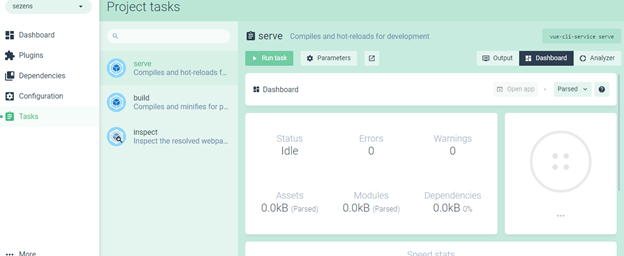

# 2.Sistemin Kullanımı

## 2.1 Geliştirme Ortamının Kurulması


Projenin geliştirmeye hazır duruma gelmesi için bilgisayarda Visual Studio Code\(kullanılan başka bir kod editörü ya da  IDE de olabilir\), Node js. Vue.js ve Git kurulumları yapılmalıdır.

Visual Studio Code [https://code.visualstudio.com/](https://code.visualstudio.com/)  adresinden indirilip  bilgisayara kurulur.

Git [https://git-scm.com/downloads](https://git-scm.com/downloads) adresinden indirilip kurulumu yapılır.

Projeye ait dosyalar VS Code içinde açılır.

Node.js kurulumu [https://nodejs.org/en/](https://nodejs.org/en/) adresinden download edilip bilgisayara kurulur.

vue  kurulumu için; node.js kurulumu tamamlandıktan sonra Command Prompt açılarak

`npm install -g @vue/cli` komutu çalıştırılır.

Komutun çalıştırılmasından sonra, işlem tamamlandığında vue.js bilgisayara yüklenmiş olacaktır.

## 2.2 Vue.js ve Proje Entegrasyonu

Entegrasyonu yapabilmek için üzerinde çalışılacak proje dosyalarının bilgisayarda bulunması gereklidir. 

Var olan proje dosyasında belirtilen adımlar takip edilerek, vue.js entegrasyonu gerçekleştirilir.

Proje Dosyasını aç -&gt; Sağ tık -&gt;” Git Bash Here”  tıkla,  Açılan komut sayfasına “`npm install`” komutunu çalıştır. Komut başarılı bir şekilde tamamlandığında projenin olduğu dosya dizinin içerisinde "_node\_modules_" adında klasör oluşmuş olmalıdır.

## 2.3 Vue Ui ve Proje Kullanımı

Vue ile proje entegrasyonunu başarılı bir şekilde tamamladıktan sonra Vue Arayüzünü kullanmaya başlayabilirsiniz. 

Arayüzü açmak için Command Prompt "`vue ui "` komutu çalıştırılmalıdır. \( Arayüzü kullandığınız süre boyunca command prompt kapatılmamalıdır aksi halde arayüz ile olan bağlantı kopacaktır.\) Komutu çalıştırdığınızda, tarayıcınızda Vue Arayüzü gelmiş olmalıdır.

### 2.3.1 Vue Ui da Projenin Açılması

Proje Entegrasyonunda `npm install` komutunu proje dosyasının içinde çalıştırdığımız için vue arayüzünde, çalışacağımız projenin dosya dizini otamatik  eklenmiş olarak gelmelidir. Eğer dizin otamatik olarak gelmedi ise “İçe Aktar”/”import” sekmesinden çalışacağımız proje dosyalarını vue’ya aktarabiliriz.

### 2.3.2 Vue Ui da Yapılan İşlemler ve Açıklamaları

<table>
  <thead>
    <tr>
      <th style="text-align:left"><b>Sekmeler</b>
      </th>
      <th style="text-align:left">İ<b>şlevleri</b>
      </th>
    </tr>
  </thead>
  <tbody>
    <tr>
      <td style="text-align:left"><b>Plugins(Eklentiler)</b>
      </td>
      <td style="text-align:left">Sekmesinde proje için bulunan eklentiler yer alacaktır farklı bir ihtiyaç
        gelişmediği sürece eklentiler değiştirilmemelidir.</td>
    </tr>
    <tr>
      <td style="text-align:left">
        
<b>Dependencies </b>
        

        
<b>(Bağımlılıklar)</b>
        

      </td>
      <td style="text-align:left">Yapılan geliştirmelerde ihtiyaç duyulan kütühanelerin yer aldığı bölümdür,
        hangi kütühanelerin hangi amaç için kullanıldığı eklentinin sağ tarafında
        yer alan more informations kısmından ulaşılabilir. Kütüphaneler install
        dependencies ile yüklenebileceği gibi proje içerisinde de düzenlenebilir.(Proje
        içerisinde bu kütüphanelerin bilgisine ulaşmak için projenin bulunduğu
        dosyada Public->Index dizini kullanılabilir.)</td>
    </tr>
    <tr>
      <td style="text-align:left"><b>Tasks (Görevler)</b>
      </td>
      <td style="text-align:left">Proje için gerekli Serve Build Inspect görevleri gerçekleştirilir.</td>
    </tr>
    <tr>
      <td style="text-align:left"><b>Serve</b>
      </td>
      <td style="text-align:left">Sekmesine gelindiğinde Run Task bölümünün yer aldığı sayfa açılır bu sayfadan
        run task diyerek Sitenin local olarak tarayıcı da açılması ve yapılan her
        değişikliğin canlı olarak görünmesi sağlanır.Site otomatik olarak açılmadı
        ise aynı sayfada bulunan “Open app” tıklanarak açılabilir. Bu taskı durduğunuzda
        vs code üzerinden yaptığınız değişikleri site üzerinde görüntüleyemezsiniz,
        o yüzden geliştirme yapıldığı süre boyunca açık kalmalıdır.</td>
    </tr>
    <tr>
      <td style="text-align:left"><b>Build</b>
      </td>
      <td style="text-align:left">Yapılan değişiklikler tamamlandıktan sonra projenin son hale getirilmesi
        için kullanılır. Build çalıştırıldığında projenizin içinde, yapılandırma
        ayarlarında belirtilen output directorynin bulunduğu dizinde dosya oluşturulacaktır(bu
        dosyanın adı default olarak “dist”dir). Bu dosyanın oluşturulmasıyla proje
        yapılan son halinde kullanıma hazır olur. Her buildde var olan dist dosyası
        silinerek yerine yenisi oluşturulur bu yüzden yapılacak önemli değişikliklerde
        back-up alınmalıdır.</td>
    </tr>
  </tbody>
</table>