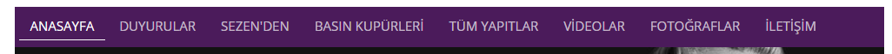

# 6.Sayfa Düzenleri

### 6.1 Yeni Bir Sayfa Yaratma Örneği

Bu örnek üzerinden ana sayfaya yeni bir sayfa eklenmesi ve bununla birlikte sayfalar ve içerikleri arasındaki ilişki açıklanmaktadır.



Resimde görünen sayfalara bir yenisini eklemek istersek izlenmesi gereken adımlar aşağıdaki gibi olmalıdır.

* Components dosyası altına açmak istenen sayfa adında .vue dosyası açılır.  Örn: Eklentiler.vue
* Eklentiler.vue için router.js'e sırası ile aşağıdaki şekilde eklemeler yapılır.

```javascript
import Orneksayfa from './components/Orneksayfa.vue';
export default new Router {
    routes: [{
    path: '/:lang',
    ...
      children: [
    ...
```


Sayfanın dil yapısını bu router belirler. Bütün sayfalar bu router'ın child router sayfalarıdır. Dilin yapısına göre sayfalar buradan çevirleri algılar. Dolayısı ile yeni bir sayfa ekleneceği zaman bu router'ın children router'ı olarak tanımlanmalıdır.


```javascript
{        
        path: 'orneksayfa',
        component: Orneksayfa
},
```


 Yeni sayfa için router ve  router-view de görüntülenecek component sırası ile bu şekilde tanımlanır.


> * Eklenen bölümün anasayfada gözükmesi için;

> _components-share-navigation.vue_  içine belirtilen şekilde güncelleme yapılmalıdır.

```javascript
<router-link tag="a" :to="'/'+lng+'/orneksayfa'" active-class="active">Orneksayfa</router-link>
```


Components'de genel olarak sayfanın statik dizaynı yer alır. İçerikteki dinamik kısımların kodu view altında bulunmaktadır.


View altında, dinamik olarak genellikle serverdan gelen datalar ve içeriklerin sayfada nasıl gösterileceği düzenlenir. Örn: sayfada gösterilen tarihin biçimi sayfaya ait view üzerinde yapılan düzenleme ile oluşturulur.

### 6.2 Sayfalarda Dil Ayarları

Sitede Türkçe ve İngilizce olmak üzere iki dil aktif durumdadır.

Var olan ya da yeni eklenen sayfanın dil ayarlarını yapmak için sırası ile izlenmesi gereken yollar aşağıdaki gibidir. Örnekte yeni eklenen sayfa için adımlar bulunmaktadır.

* Bir önceki örnekte yarattığımız yeni sayfanın dil ayarları için store\_modules altında Language.js dosyası içine hangi dilde nasıl görüneceğini şu şekilde belirtebiliriz. 

```javascript
tr: {
    ...
    OrnekSayfaName : 'Örnek Sayfa',
}
en: {
    ...
    OrnekSayfaName :'Example Page',}
```

* Eklenti.vue içine vuex kütüphanesine ait olan mapgetters helper ile gerekli olan düzenleme örnekteki şeklide gerçekleştirilmelidir.

```javascript
<script>
import { mapGetters } from "vuex";
export default {
  computed: {
    ...mapGetters(["t"])
  }
};
</script>
```

Bu değişikliği yaptıktan sonra sitede aktif olması için tekrar navigation.vue içine gidip router kodumuzu şekildeki gibi düzenlemeliyiz.

```javascript
<router-link tag="a" :to="'/'+lng+'/orneksayfa'" active-class="active">{{ t.OrnekSayfaName }}</router-link>
```

